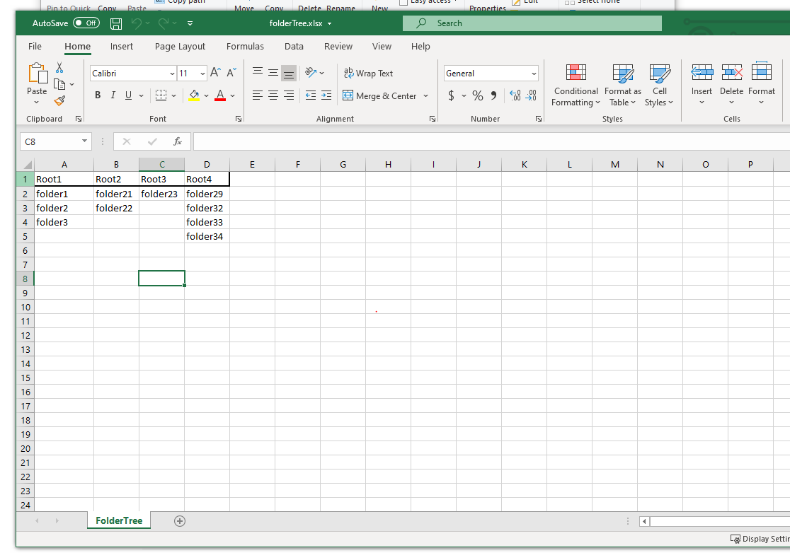

Python script to create folders and files to Google Drive

run pip install requirements.txt

First of all go to https://developers.google.com/drive/api/v3/quickstart/python and press Enable the Drive API an wait for a window to pop up.

1) Give a name you want to your project. 
2) Download the credentials.json file which will be automatically created
3) Move the downloaded credentials.json file to the credential folder "GoogleDriveScript/credential"

Now run 'python folderCreation.py' and you'll see the browser will open the Google Drive sign in windows.
Sign in into your google drive account and you'll see you have to allow the script to have access to you account.
Whne you finish the entire process the authentication will be done. 
Now if you go to the folder credential where you moved the credentials.json file before you'll find a file called "token.pickle" which is the token useed to authenticate for the next times you'll use the script.

In the folderTree folder you have to create a Excel file Like this:

